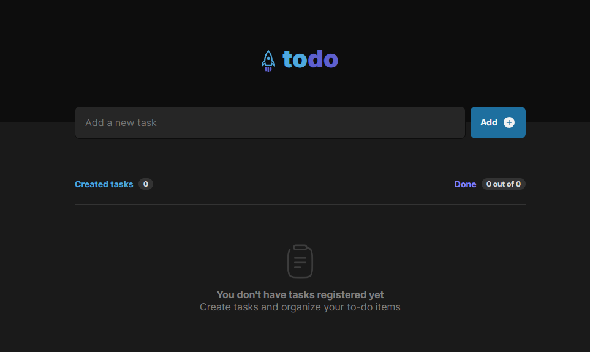

# To Do List

This challenge was built during my React studies in the Rocketseat's Ignite bootcamp.

## Overview

### App
Check it out now and test the app: [To Do List](https://nimble-monstera-189942.netlify.app/).

### Screenshot

### Built with

- React
- TypeScript

### What I learned

This challenge was a good way for me to start my learning and applications of React and TypeScript.

### Continued development

For my next project, I will study and apply the following concept:

- SPA with React

## Author

- Linkedin - [Thullyo Damasceno](https://www.linkedin.com/in/thullyo-damasceno-375083231)